# Synapse Analytics Engine
## Official Platform Documentation — v2.0

---

## 1. Overview

### 1.1 What is this platform?
**Synapse Analytics Engine** is a full-stack, AI-augmented business intelligence and deployment planning platform. It allows users to input any business niche, and it will autonomously search the live internet, identify top real-world competitors, analyze their public sentiment, mathematically predict their future pricing strategy, and generate a full strategic launch blueprint — all without a single LLM call.

### 1.2 Why was it built?
In an era dominated by Generative AI (LLMs) which often suffer from hallucinations, high API costs, and non-deterministic outputs, Synapse was built to provide **hard, calculated, and deterministic intelligence**. It was engineered to give founders, marketers, and analysts actionable, real-time data about their competitors without relying on black-box AI. It relies on live web scraping, classical Natural Language Processing (NLP), machine learning, and rule-based expert systems.

### 1.3 Main Focus
The core focus of Synapse is **Speed, Accuracy, and Actionable Strategy**.
1. **Live Discovery:** We don't use static databases; we scrape the live internet to find who is competing *today*.
2. **Deterministic Analysis:** Every sentiment score and price prediction is mathematically reproducible.
3. **Executive Presentation:** The data is instantly readable via interactive Recharts visualizations (Scatter and Line plots) so executives can make immediate pricing and strategy decisions.
4. **Active Deployment Planning:** The Niche Launchpad Engine transforms passive data into a concrete, phased business launch plan with break-even math and execution roadmaps.

---

## 2. System Workflow Architecture

The platform operates on a completely decoupled, asynchronous architecture.

```mermaid
sequenceDiagram
    participant User
    participant React Frontend
    participant Supabase DB
    participant FastAPI Backend
    participant DuckDuckGo

    User->>React Frontend: Enters Business Niche
    React Frontend->>FastAPI Backend: POST /api/analyze {niche}
    FastAPI Backend->>DuckDuckGo: Scrape Search Results (Live)
    DuckDuckGo-->>FastAPI Backend: Returns HTML Snippets & URLs
    
    rect rgb(20, 30, 50)
    Note over FastAPI Backend: Data Processing Pipeline
    FastAPI Backend->>FastAPI Backend: 1. Filter out SEO Listicles
    FastAPI Backend->>FastAPI Backend: 2. Run NLTK VADER Sentiment Analysis
    FastAPI Backend->>FastAPI Backend: 3. Run RandomForest ML Forecast
    end

    FastAPI Backend->>Supabase DB: Insert Competitor Metrics (JSON)
    Supabase DB-->>React Frontend: Real-time WebSocket Trigger
    React Frontend->>User: Re-render Recharts Dashboard
```



### 2.1 Data Flow (Step-by-Step)
1. **User Input:** The user enters a business niche (e.g., "CRM software") into the `AnalyzeForm` component.
2. **API Call:** The React frontend sends a `POST /api/analyze` request with `{ niche: "CRM software" }` to the FastAPI backend.
3. **Live Scraping:** The backend uses the `duckduckgo-search` (DDGS) Python library to perform a live web search for `"{niche} pricing OR competitors"`. DuckDuckGo was chosen because it does not require API keys and does not aggressively block automated requests, unlike Google.
4. **Filtering:** The raw search results are filtered to remove SEO listicle pages (e.g., "Top 10 Best…") that are not actual competitors. This is done via keyword exclusion on URLs and titles.
5. **Sentiment Analysis:** Each competitor's search snippet is analyzed using NLTK's VADER (Valence Aware Dictionary and sEntiment Reasoner). VADER is specifically tuned for short web/social-media text and assigns a polarity score from `-1.0` (Highly Negative) to `+1.0` (Highly Positive).
6. **Price Forecasting:** A simulated 12-month historical price series is generated for each competitor (with realistic noise/volatility). A `RandomForestRegressor` from Scikit-Learn is trained on this series and predicts the price for Month 13 (`predicted_next_price`).
7. **Database Insert:** The processed competitor data is inserted into the `competitor_metrics` table in Supabase (PostgreSQL).
8. **Real-time Push:** Supabase's Realtime engine detects the INSERT and pushes the new rows over a WebSocket channel to the React frontend.
9. **UI Update:** The React `App.jsx` component receives the WebSocket payload and merges it into the `competitors` state, causing all child components (MetricsCards, CompetitorTable, Charts) to re-render instantly.

---

## 3. Technology Stack & Detailed Requirements

### 3.1 Frontend Stack (UI/UX)
Built for speed, reactivity, and a premium "wow" factor.

| Library / Tool | Version | Purpose | Why This Library? |
|---|---|---|---|
| **React.js** | 18.x | Component-based UI framework | Industry standard for building interactive SPAs |
| **Vite** | 8.x | Build tool & dev server | 10x faster HMR (Hot Module Replacement) than Webpack/CRA |
| **Tailwind CSS** | 4.x | Utility-first CSS framework | Enables rapid implementation of glassmorphic, dark-mode design with custom tokens (`emerald-accent`, `electric-blue`, `glass-card`) |
| **Recharts** | 2.x | Interactive data visualization | React-native charting library; used for Line Charts, Scatter Plots, and the Strategic Matrix in the Launchpad Engine |
| **@supabase/supabase-js** | 2.x | Database client + Realtime subscriptions | Enables WebSocket-based real-time data sync so the UI updates the instant backend writes data |

### 3.2 Backend Stack (The Engine)
Built for asynchronous web requests, text processing, and math.

| Library / Tool | Version | Purpose | Why This Library? |
|---|---|---|---|
| **Python** | 3.11+ | Core language | Industry standard for data scraping and ML |
| **FastAPI** | Latest | Web framework | Natively supports `async/await`, auto-generates OpenAPI (Swagger) docs, and uses Pydantic for strict type validation |
| **Uvicorn** | Latest | ASGI server | High-performance server to run the FastAPI app |
| **duckduckgo-search (DDGS)** | Latest | Live web scraping | Bypasses bot-detection mechanisms that block standard `requests` calls; no API keys required |
| **NLTK (VADER)** | Latest | Sentiment analysis | Runs entirely locally, is deterministic, and is tuned for short web text snippets. No LLM needed |
| **Scikit-Learn** | Latest | ML price forecasting | `RandomForestRegressor` provides robust time-series predictions without deep learning overhead |
| **supabase-py** | Latest | Database client | Official Python SDK for reading/writing structured data to the PostgreSQL database |
| **Pydantic** | v2 | Request/response validation | Ensures strict type safety on all incoming JSON payloads (e.g., `AnalyzeRequest`, `BulkDeleteRequest`) |
| **python-dotenv** | Latest | Environment variables | Securely loads API keys and database URLs from local `.env` files |

### 3.3 Database Stack (Storage)

| Component | Purpose |
|---|---|
| **Supabase (PostgreSQL)** | Open-source Firebase alternative. Chosen for its **Real-time Webhooks** — when the Python backend writes a row, Supabase instantly pushes it over a WebSocket to the React frontend |
| **Row Level Security (RLS)** | Enabled on all tables for secure data access. Permissive policies are set for `anon` role during development |
| **Realtime Publications** | The `competitor_metrics` and `launch_blueprints` tables are added to `supabase_realtime` for live INSERT/DELETE event streaming |

### 3.4 Database Schema

#### Table: `competitor_metrics`
| Column | Type | Description |
|---|---|---|
| `id` | UUID (PK) | Unique identifier, auto-generated |
| `created_at` | TIMESTAMPTZ | Auto-set timestamp |
| `company_name` | TEXT | Scraped competitor name |
| `company_url` | TEXT | Scraped competitor URL |
| `business_niche` | TEXT | The niche the user searched for |
| `current_price` | NUMERIC(12,2) | Simulated current price |
| `predicted_next_price` | NUMERIC(12,2) | ML-forecasted next-period price |
| `sentiment_score` | NUMERIC(5,4) | VADER compound sentiment score (-1 to +1) |
| `historical_prices` | JSONB | Array of simulated historical prices for charting |

#### Table: `industry_templates`
| Column | Type | Description |
|---|---|---|
| `id` | SERIAL (PK) | Auto-incrementing ID |
| `category_keyword` | TEXT (UNIQUE) | Niche keyword (e.g., `saas`, `ecommerce`, `agency`) |
| `steps_json` | JSONB | Deeply structured, multi-phase launch roadmap |

#### Table: `launch_blueprints`
| Column | Type | Description |
|---|---|---|
| `id` | UUID (PK) | Unique identifier |
| `created_at` | TIMESTAMPTZ | Auto-set timestamp |
| `niche` | TEXT | The niche this blueprint belongs to |
| `recommended_price` | NUMERIC(12,2) | Algorithmically calculated entry price |
| `fixed_costs` | NUMERIC(12,2) | User-input monthly fixed costs |
| `break_even_volume` | NUMERIC(12,2) | Calculated break-even quantity |
| `roadmap_progress` | JSONB | Tracks which roadmap steps the user has completed |

---

## 4. Platform Features — Detailed Breakdown

### 4.1 Competitor Intelligence Tab

#### 4.1.1 Analysis Form (`AnalyzeForm.jsx`)
- **What it does:** Accepts a business niche string from the user and triggers the entire scraping + ML pipeline.
- **How it works:** Sends a `POST /api/analyze` request to the FastAPI backend. While processing, a loading spinner and notification are displayed. On success, the results flow in via Supabase Realtime.

#### 4.1.2 Metrics Cards (`MetricsCards.jsx`)
- **What it does:** Displays aggregated KPI cards at the top of the dashboard.
- **Metrics shown:**
  - **Total Competitors Found:** Count of scraped results.
  - **Average Price (₹):** Mean of all `current_price` values.
  - **Average Sentiment:** Mean of all `sentiment_score` values, with a color-coded indicator (green for positive, amber for neutral, red for negative).
  - **Forecast Trend:** Shows whether average prices are predicted to increase or decrease.

#### 4.1.3 Competitor Table (`CompetitorTable.jsx`)
- **What it does:** Renders all scraped competitor data in a sleek, dark-mode data table.
- **Columns:**
  - **Checkbox:** For selecting specific rows for bulk deletion.
  - **Company:** Name + clickable URL linking to the competitor's actual website.
  - **Niche:** The business niche category.
  - **Current Price (₹):** The competitor's current pricing in Indian Rupees.
  - **Sentiment:** Color-coded badge (Positive/Neutral/Negative) with the raw VADER score.
  - **Predicted Price (₹):** ML-forecasted next-period price.
  - **Δ Forecast:** The delta between predicted and current price, showing market direction (green for growth, red for decline).

#### 4.1.4 Bulk Deletion System
- **UI:** Each row has a checkbox. The table header has a "Select All" master checkbox.
- **Delete Button Dropdown:** Clicking the red "Delete" button in the table header opens a dropdown with two options:
  1. **Delete Selected (N):** Removes only the checked rows. Disabled if no rows are selected.
  2. **Delete All Records:** Opens a two-step confirmation modal with a disclaimer warning before permanently deleting all data.
- **Backend Endpoint:** `POST /api/competitors/bulk-delete` accepts a JSON body `{ "ids": [...] }`. We use `POST` instead of `DELETE` because modern browsers/proxies often strip JSON bodies from HTTP DELETE requests, causing silent failures.
- **Database Operation:** Supabase executes a single efficient `delete().in_("id", ids)` query.

### 4.2 Niche Launchpad Engine Tab

This is the core business planning module that transforms passive intelligence into an active deployment strategy.

#### 4.2.1 Algorithmic Pricing Logic
The engine aggregates all competitors for the selected niche and calculates:
- **Market Average Price:** `AVG(current_price)` across all competitors in the niche.
- **Average Sentiment:** `AVG(sentiment_score)` across all competitors.

**Pricing Rules (Deterministic, No LLM):**
| Condition | Strategy | Formula | Rationale |
|---|---|---|---|
| `avg_sentiment < 0` | Premium Positioning | `Entry Price = Avg Price × 1.10` | Market is unhappy → opportunity to provide a better, premium product |
| `avg_sentiment >= 0` | Disruptive Positioning | `Entry Price = Avg Price × 0.85` | Market is content → undercut by 15% to steal market share |

#### 4.2.2 Interactive Financial Simulator
- **What it does:** Allows the user to model their business economics with live sliders.
- **Controls:**
  - **Monthly Fixed Costs (F):** Slider from ₹0 to ₹50,000.
  - **Variable Cost Per Unit (V):** Slider from ₹0 to the recommended entry price.
- **The Math:** Break-Even Volume (Q) is calculated using the deterministic formula:
  ```
  Q = F / (P - V)
  ```
  Where `P` is the Recommended Entry Price, `F` is Monthly Fixed Costs, and `V` is Variable Cost Per Unit.
- **Real-time update:** As the user drags either slider, the Break-Even Required value updates instantly.

#### 4.2.3 Strategic Matrix Positioning Plot
- **What it does:** A Recharts Scatter Plot that maps Price (X-axis) vs Sentiment (Y-axis) for all competitors.
- **How it works:**
  - Each competitor is rendered as a cyan dot.
  - The user's calculated **Optimal Entry Point** is rendered as a pulsating neon-emerald crosshair (`🎯`).
  - This visually demonstrates where the new product would sit in the market landscape relative to existing players.

#### 4.2.4 Deep Execution Roadmaps
- **What it does:** Provides a phased, industry-specific launch checklist.
- **How it works:**
  1. The backend matches the user's niche keyword against the `industry_templates` database table (supports `saas`, `ecommerce`, `agency`).
  2. It retrieves a deeply structured, multi-phase JSON array.
  3. Each phase contains 2 actionable steps (e.g., *Phase 1: Validation → Conduct 50 user interviews*).
- **Phases covered (example: SaaS):**
  - Phase 1: Validation
  - Phase 2: MVP Build
  - Phase 3: Beta Launch
  - Phase 4: Scaling
- **Interactive UI:** The roadmap renders as a vertical neon timeline. Clicking a step toggles its state from muted gray to glowing electric-blue (`#00f0ff`), letting founders track their launch progress visually.

### 4.3 Analytics View (Sidebar)

#### 4.3.1 Line Chart — Historical Price Trajectories
- **What it does:** Plots the simulated historical price data for the top 3 competitors, plus their ML-predicted future price.
- **Data source:** The `historical_prices` JSONB array stored in `competitor_metrics`.
- **Visual:** Multiple colored lines (emerald, cyan, purple) converging on a "Forecast" endpoint.

#### 4.3.2 Scatter Plot — Sentiment vs. Price Growth
- **What it does:** Plots every competitor as a bubble where X = Sentiment Score and Y = Price Growth (Predicted - Current).
- **Purpose:** Quickly identifies which competitors have negative sentiment AND rising prices (vulnerable targets).

#### 4.3.3 Niche History Filter
- **What it does:** The Analytics view now includes the same Niche History Selector dropdown as the Dashboard.
- **Benefit:** Charts filter to show only data for the selected historical niche.

#### 4.3.4 Reset Analytics
- **What it does:** A red "Reset Analytics" button that opens a confirmation modal.
- **Effect:** Deletes all competitor records from the database, clearing all charts and tables.

### 4.4 Global Niche History Filtering

#### How it works:
1. Every time the backend scrapes competitors, each record is tagged with a `business_niche` field.
2. The React `App.jsx` component extracts all unique `business_niche` values from the global `competitors` array: `[...new Set(competitors.map(c => c.business_niche))]`.
3. A `selectedNiche` state variable acts as a global filter.
4. A sleek dropdown labeled **"Viewing: [niche]"** appears in the dashboard header.
5. Switching the dropdown instantly filters the CompetitorTable, MetricsCards, Charts, and Launchpad Engine to only show data for that niche.
6. **No data is lost.** All previously searched niches remain accessible without re-scraping.

---

## 5. API Endpoints Reference

| Method | Endpoint | Description | Request Body |
|---|---|---|---|
| `POST` | `/api/analyze` | Trigger live scraping + ML pipeline | `{ "niche": "string" }` |
| `GET` | `/api/competitors` | Fetch all stored competitor records | — |
| `DELETE` | `/api/competitors/{id}` | Delete a single competitor by ID | — |
| `POST` | `/api/competitors/bulk-delete` | Delete multiple competitors by IDs | `{ "ids": ["uuid1", "uuid2"] }` |
| `DELETE` | `/api/competitors` | Delete ALL competitor records | — |
| `POST` | `/api/calculate-breakeven` | Calculate break-even volume | `{ "recommended_price": 100, "fixed_costs": 5000, "variable_cost": 30 }` |
| `GET` | `/api/launchpad/{niche}` | Get pricing, roadmap, and strategic data | — |

---

## 6. Design System

### 6.1 Color Palette
| Token | Hex | Usage |
|---|---|---|
| `emerald-accent` | `#007F5F` | Primary brand color, positive indicators, chart lines |
| `electric-blue` | `#00f0ff` | Accent highlights, active tab indicators, neon glows |
| `slate-900` | `#0f172a` | Primary background |
| `slate-800` | `#1e293b` | Card backgrounds, secondary surfaces |
| `red-400` | `#f87171` | Negative indicators, delete buttons, warnings |
| `amber-400` | `#fbbf24` | Neutral sentiment, caution states |

### 6.2 Design Principles
- **Glassmorphism:** Cards use `backdrop-blur`, semi-transparent backgrounds, and subtle border gradients.
- **Micro-animations:** Every element uses `animate-fade-in` and `animate-slide-up` for smooth entry transitions.
- **Neon Glow Effects:** Active states use CSS `text-shadow` and `box-shadow` with electric-blue for a cyberpunk aesthetic.
- **Dark Mode Only:** The entire UI is designed for dark mode to reduce eye strain during extended analysis sessions.

### 6.3 Currency
All financial values across the platform are displayed in **Indian Rupees (₹ / INR)**.

---

## 7. File Structure

```
MultiAgentSystem/
├── backend/
│   ├── main.py                  # FastAPI app: all endpoints, Pydantic models, ML pipeline
│   ├── analytics.py             # Additional analytics utilities
│   ├── requirements.txt         # Python dependencies
│   ├── .env                     # Supabase URL + API key (not committed)
│   └── venv/                    # Python virtual environment
├── frontend/
│   ├── index.html               # Entry HTML file
│   ├── tailwind.config.js       # Tailwind CSS configuration with custom tokens
│   ├── src/
│   │   ├── main.jsx             # React entry point
│   │   ├── App.jsx              # Root component: state management, routing, Realtime subscription
│   │   ├── supabaseClient.js    # Supabase client initialization
│   │   ├── index.css            # Global styles, custom animations, glassmorphic utilities
│   │   └── components/
│   │       ├── AnalyzeForm.jsx      # Niche input form
│   │       ├── MetricsCards.jsx     # KPI summary cards
│   │       ├── CompetitorTable.jsx  # Data table with checkbox bulk delete
│   │       ├── LaunchpadEngine.jsx  # Niche Launchpad Engine (simulator, matrix, roadmap)
│   │       └── Sidebar.jsx          # Navigation sidebar
│   └── .env                     # Supabase public URL + anon key
├── supabase/
│   ├── schema.sql               # Initial database schema
│   ├── migration_01.sql         # First migration
│   ├── migration_02.sql         # Second migration (Realtime, RLS)
│   └── migration_03.sql         # Third migration (Launchpad tables, deep roadmaps)
└── DOCUMENTATION.md             # This file
```

---

## 8. Future Enhancements

The platform is designed to be highly extensible. Planned future modules include:

1. **User Authentication:**
   - *Concept:* Integrate Supabase Auth so different founders can have private, isolated dashboards with secure login.
   
2. **Export Functionality:**
   - *Concept:* Allow users to export the Launchpad Business Plan and Competitor Intelligence tables to PDF or CSV for investor presentations.

3. **Deep Feature Extraction (NLP):**
   - *Concept:* Instead of just scraping the search engine snippet, the backend will visit the competitor's actual homepage and use NLTK Part-of-Speech tagging to extract the most frequently used nouns (e.g., "Enterprise", "Open-Source").
   - *Value:* Automatically generates a Feature Matrix for the dashboard.

4. **Social Proof & Audience Scraping:**
   - *Concept:* Appending `+ reviews` to queries and scraping Reddit/Trustpilot to run sentiment analysis on *actual customer feedback* rather than marketing copy.

5. **Automated Pricing Tier Extraction:**
   - *Concept:* Deploying Regex-based crawlers to visit the competitor's `/pricing` pages and extract their actual minimum and maximum price bands.

6. **Time-Series Cron Jobs:**
   - *Concept:* Implementing `apscheduler` to automatically re-scrape known competitors every 7 days to generate real historical trendlines.

7. **Rule-Based SWOT Engine:**
   - *Concept:* A deterministic algorithm that evaluates sentiment, price, and market presence to automatically generate Strengths, Weaknesses, Opportunities, and Threats.

8. **Advanced Web Scraping:**
   - *Concept:* Transition from DuckDuckGo search snippets to full HTML DOM parsing using Playwright to extract exact real-world pricing tiers from competitor landing pages.

---

*Document Version: 2.0 — Last Updated: June 30, 2026*
